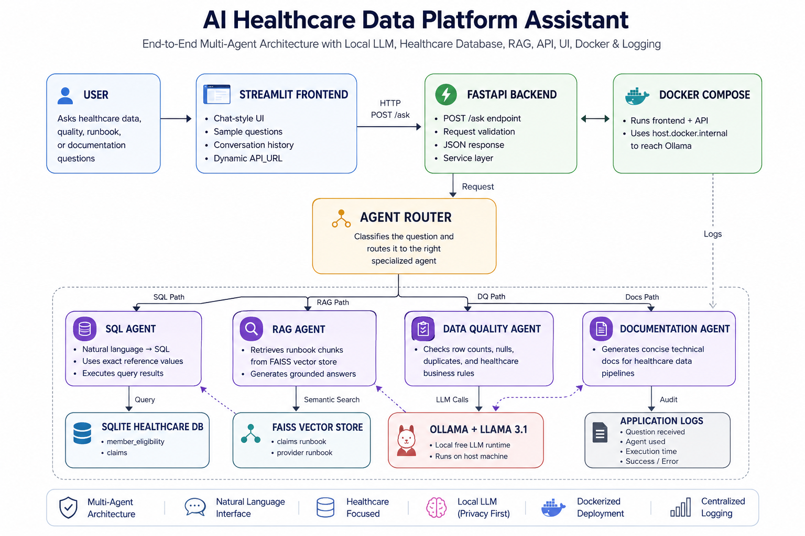
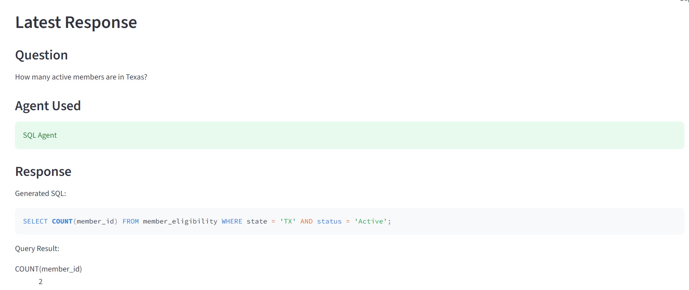
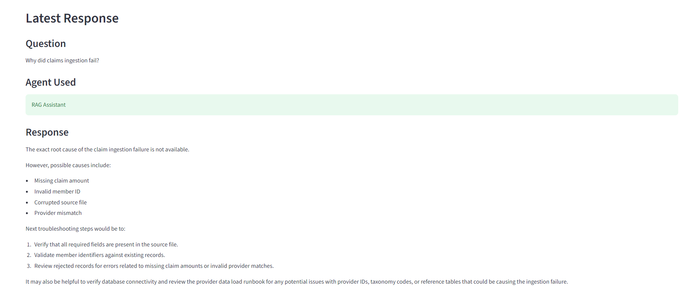
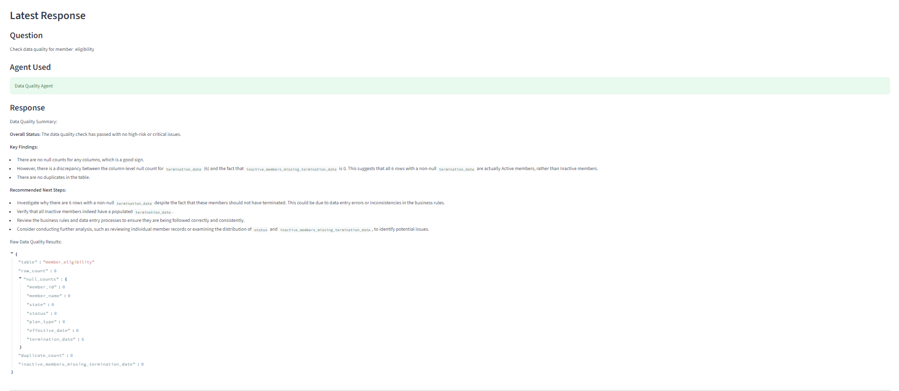
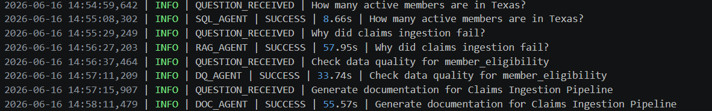

# AI Healthcare Data Platform Assistant

An end-to-end AI-powered healthcare data platform that combines SQL generation, Retrieval-Augmented Generation (RAG), data quality validation, and automated documentation using a multi-agent architecture.

The platform enables users to ask natural language questions about healthcare data, troubleshoot data pipelines, validate data quality rules, and generate technical documentation through a unified interface.

---

## Architecture



---

## Features

### SQL Agent

* Converts natural language questions into SQL
* Executes queries against healthcare datasets
* Returns results with generated SQL

Example:

**Question**

How many active members are in Texas?

**Result**

2 Active Members

---

### RAG Assistant

* Uses FAISS vector search
* Retrieves healthcare runbooks and troubleshooting guides
* Generates grounded answers using Ollama and Llama 3.1

Example:

**Question**

Why did claims ingestion fail?

**Result**

Returns possible root causes and troubleshooting steps.

---

### Data Quality Agent

* Validates healthcare business rules
* Detects null values
* Identifies duplicate records
* Generates AI-powered quality summaries

Example:

**Question**

Check data quality for member_eligibility

---

### Documentation Agent

* Generates technical documentation automatically
* Documents pipelines, data quality rules, dependencies, and ownership

Example:

**Question**

Generate documentation for Claims Ingestion Pipeline

---

## Technology Stack

### Frontend

* Streamlit

### Backend

* FastAPI

### AI & LLM

* Ollama
* Llama 3.1
* LangChain

### Data Layer

* SQLite
* FAISS Vector Store

### DevOps

* Docker Compose
* Environment Variables
* Centralized Logging

### Programming

* Python

---

## Project Architecture

User

↓

Streamlit UI

↓

FastAPI Backend

↓

Agent Router

↓

SQL Agent | RAG Agent | Data Quality Agent | Documentation Agent

↓

SQLite + FAISS + Ollama

---

## Screenshots

### Homepage


### SQL Agent



### RAG Assistant



### Data Quality Agent



### Documentation Agent


### Logging & Monitoring



---

## Running Locally

```bash
git clone <repository>

cd AI-Healthcare-Data-Platform-Assistant

pip install -r requirements.txt

uvicorn backend.api.main:app --reload

streamlit run frontend/app.py
```

---

## Running with Docker

```bash
docker compose up --build
```

---

## Environment Variables

Create a .env file:

```env
OLLAMA_MODEL=llama3.1
OLLAMA_HOST=http://localhost:11434
DATABASE_PATH=backend/db/healthcare.db
VECTORSTORE_PATH=backend/vectorstore
API_URL=http://127.0.0.1:8000/ask
LOG_LEVEL=INFO
```

---

## Future Enhancements

* Azure OpenAI Integration
* Snowflake Support
* PostgreSQL Support
* RBAC Security
* Cloud Deployment
* Monitoring Dashboard

---

## Author

Amulya

Senior Data Engineer | AI & Data Platform Engineering
